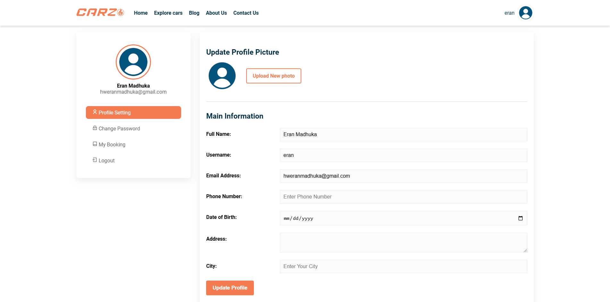
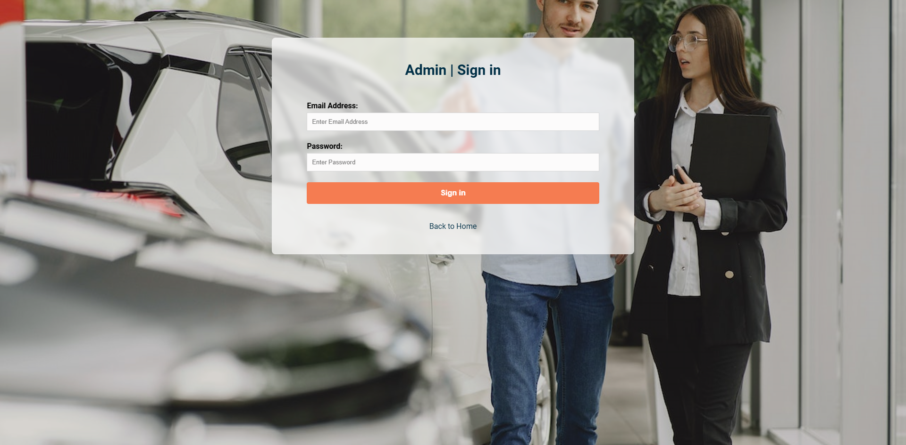
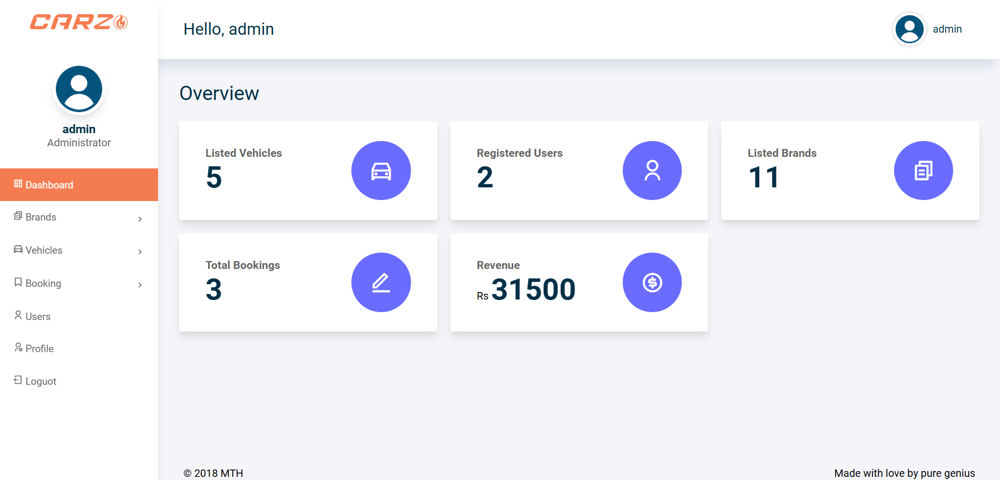
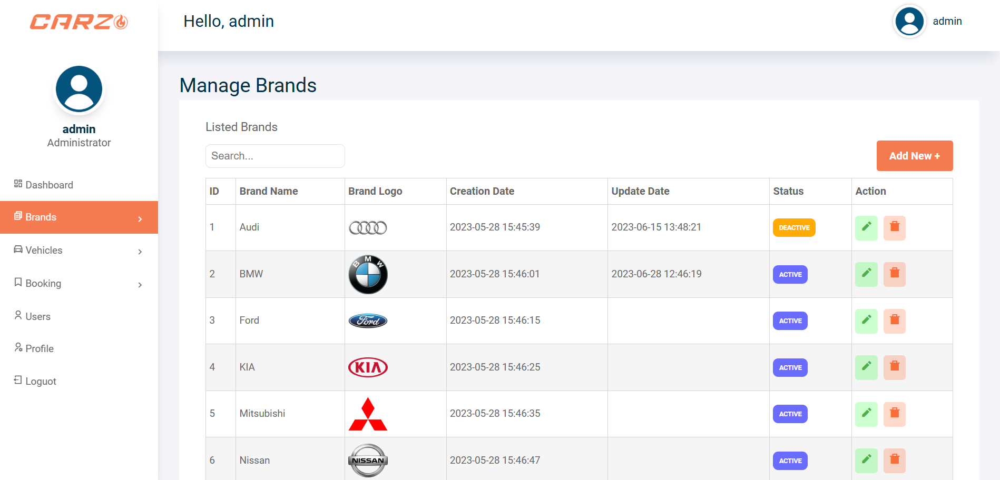
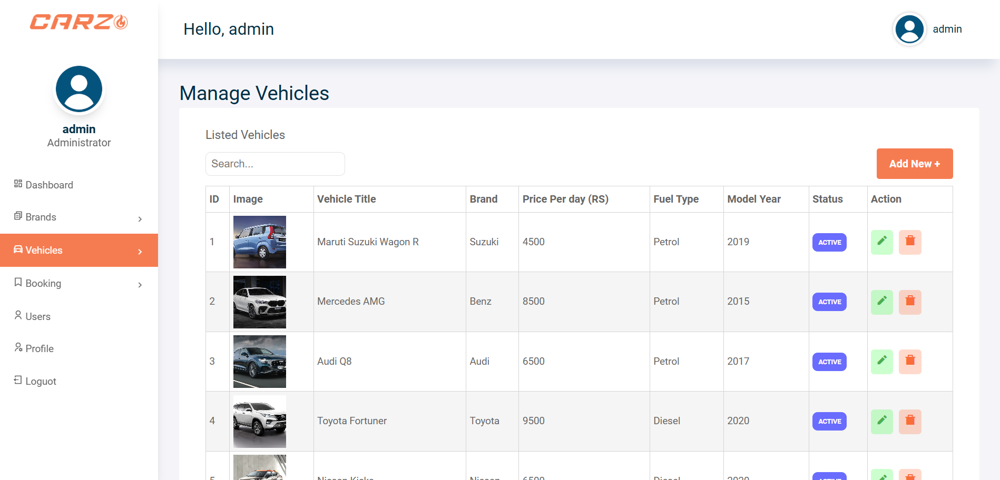
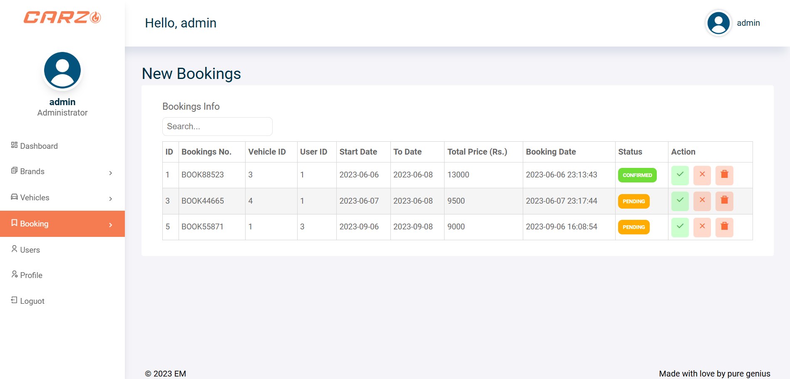
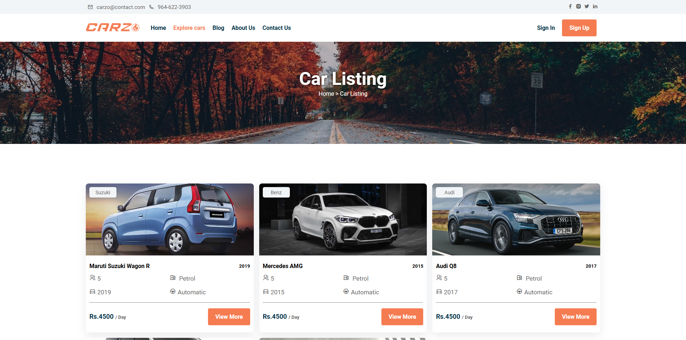
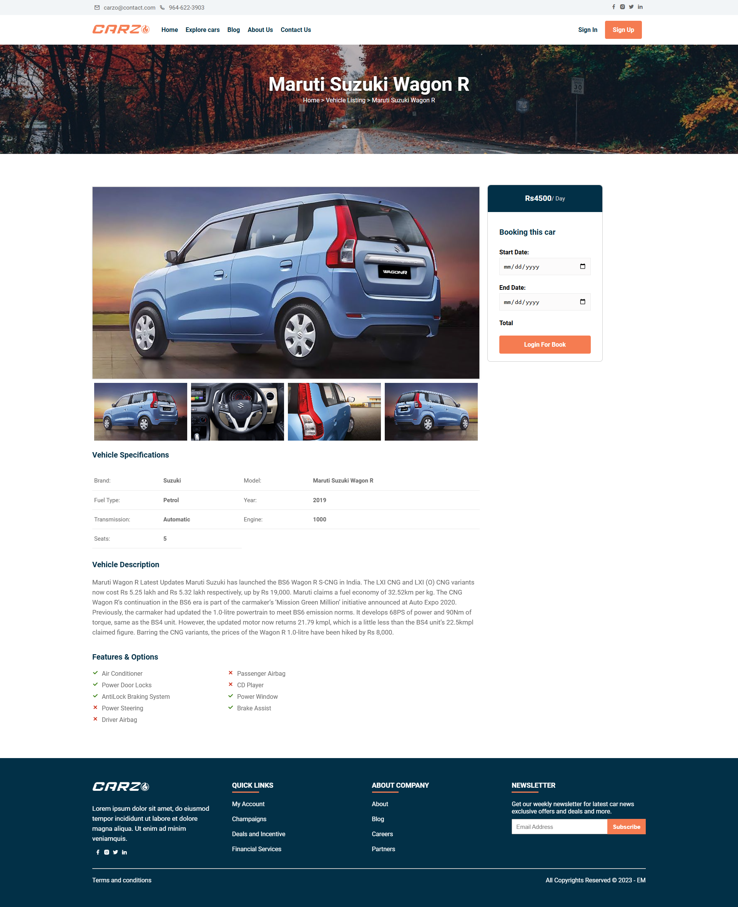

# 🚗 **carzo** – Vehicle Rental System

A comprehensive **web-based Car Rental System** developed using **HTML, CSS, JavaScript, PHP, and MySQL**, designed to streamline car rental services for both users and administrators. With an intuitive user interface and robust admin panel, the system provides a seamless experience for renting vehicles and managing rental inventory.

---

## 🚀 **Key Features**

### User Features:
- **User Registration & Login**:  
  Users can securely register and log in to their accounts to access car rental services.  
- **Vehicle Booking**:  
  Registered users can browse available vehicles, view details, and book them for rental with ease.

### Admin Features:
- **Admin Dashboard**:  
  Admins can log in to an exclusive panel to manage the system.  
- **Vehicle & Brand Management**:  
  Add new vehicles and brands to the rental fleet with full control over inventory.  
- **User and Booking Management**:  
  Monitor user activities and manage bookings efficiently.

---

## 🛠️ **Tech Stack**

- **Frontend**: HTML, CSS, JavaScript, Bootstrap  
- **Backend**: PHP  
- **Database**: MySQL  

---

## 📊 **Login Credentials**
#### Admin Login:
- URL: http://localhost/sliit/carzo/admin/
- Email: admin@email.com
- Password: admin

#### Employee
- URL: http://localhost/sliit/carzo/signin.php
- Email: user@gmail.com
- Password: user

---

## 🌟 **Screenshots**
<p align="center">
  
  
  
  
  
  
  
  
  
</p>

---

## 🔧 **Installation and Setup**

### 1. Clone the Repository

Start by cloning the project repository:

```bash
git clone https://github.com/eranmadhuka/carzo.git
```

### 2. Set Up the Database
- Import the provided database.sql file into your MySQL database.
- Update the database connection settings in includes/dbconfig.php to match your MySQL credentials (username, password, and database name).

### 3. Start a Local Server
- Use tools like XAMPP or WAMP to run a local PHP server. Ensure that the server is running and the necessary services (Apache, MySQL) are enabled.

### 4. Run the Application
- User Panel: Navigate to http://localhost/sliit/carzo/signin.php to access the user login and registration page.
- Admin Panel: Navigate to http://localhost/sliit/carzo/admin/ to access the admin dashboard.
